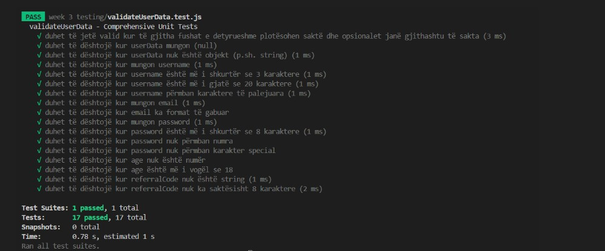
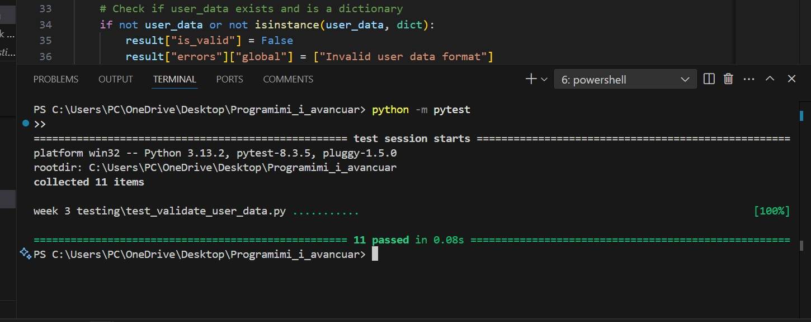

Effectiveness of AI in generating tests
Using AI to generate tests proved to be highly beneficial and efficient. The AI created a solid testing structure for the validate_user_data function, covering common validation scenarios such as missing fields, incorrect email formats, and weak passwords. This saved a lot of time and allowed me to focus more on analyzing and refining the tests, rather than creating them from scratch. However, the AI did not cover all edge cases, such as a username with exactly 3 or 20 characters, a password with exactly 8 characters, or a referral_code containing various types of characters. Additionally, the initial test structure was somewhat disorganized, so I had to group the tests based on the field being tested (username, email, password, etc.).

Strategies to improve AI-generated tests
To improve the AI-generated tests, I used a few key strategies:

Summarizing tests and adding edge cases manually.

Using pytest to ensure easy and clear execution of the tests.

Organizing the test cases into different categories to make them easier to understand and manage.

Using AI-assisted testing in real-world development
In real-world development, AI-assisted testing is incredibly valuable for quickly generating an initial test suite. It helps save time and accelerates the process of creating tests, making it easier to keep tests updated with code changes. Furthermore, AI can assist in maintaining tests after code modifications by suggesting new tests based on the latest changes.

Limitations and risks of relying on AI for test generation
While AI can be a powerful tool, there are some limitations and risks involved in fully relying on it for test generation. AI may not fully identify all the unique and specific cases related to your application, potentially missing important test scenarios. Additionally, it could generate unnecessary or redundant tests. This is why AI-generated tests should always be manually reviewed and refined to ensure they meet the project's needs.

Conclusion:
Although AI is a powerful tool, it should be used as an assistant to developers, not a complete replacement for human expertise. Combining AI with manual review ensures a more robust and reliable approach to application testing.

Screenshots of  the tests:

JS test screenshoot:

Python test screenshot:

