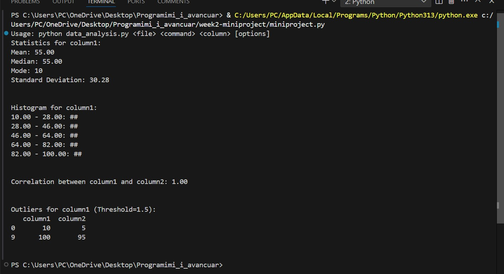

Data Analysis Script
Overview
data_analysis.py is a command-line utility designed for quick and efficient data analysis on CSV files. It utilizes pandas for data handling, NumPy for numerical computations, and SciPy for statistical functions.

The script supports four primary operations:

Calculating Basic Statistics (stats)

Generating Text-Based Histograms (histogram)

Finding the Correlation Between Two Columns (correlation)

Detecting Outliers Based on Z-Score (outliers)

Requirements
Python 3.6+ (Recommended)

pandas: For handling and reading CSV files.

NumPy: For efficient numerical operations.

SciPy: For statistical functions such as Z-score calculations.

You can install the required libraries using the following command:

bash
Copy
Edit
pip install pandas numpy scipy
File Structure & Usage
Script Name: data_analysis.py

Entry Point: The main() function processes command-line arguments and executes the requested operation.

Command-Line Invocation
bash
Copy
Edit
python data_analysis.py <file> <command> <column> [options]
Where:

<file>: The path to the CSV file (e.g., data.csv).

<command>: One of the following operations:

stats: Calculate mean, median, mode, and standard deviation for a given column.

histogram: Generate a text-based histogram for a given column.

correlation: Compute the Pearson correlation between two columns.

outliers: Detect rows with Z-scores exceeding a given threshold.

<column>: The column name to analyze (for stats, histogram, outliers) or the first column (for correlation).

[options]: Additional parameters depending on the selected command.

Commands & Examples
1. Stats
Calculate basic statistics (mean, median, mode, and standard deviation) for a specified column.

Usage:

bash
Copy
Edit
python data_analysis.py data.csv stats <column_name>
Example:

bash
Copy
Edit
python data_analysis.py data.csv stats price
Output: Displays the mean, median, mode, and standard deviation for the price column.

2. Histogram
Generate a simple text-based histogram for a specified column.

Usage:

bash
Copy
Edit
python data_analysis.py data.csv histogram <column_name> <bins>
<bins> (optional): Number of bins for the histogram (default: 10).

Example:

bash
Copy
Edit
python data_analysis.py data.csv histogram age 5
Output: Displays the histogram of the age column across 5 bins.

3. Correlation
Compute and print the Pearson correlation coefficient between two columns.

Usage:

bash
Copy
Edit
python data_analysis.py data.csv correlation <column1> <column2>
Example:

bash
Copy
Edit
python data_analysis.py data.csv correlation height weight
Output: Displays the Pearson correlation coefficient between height and weight.

4. Outliers
Detect and list rows that exceed the Z-score threshold for a given column.

Usage:

bash
Copy
Edit
python data_analysis.py data.csv outliers <column_name> <threshold>
<threshold> (optional): The Z-score threshold (default: 2.0).

Example:

bash
Copy
Edit
python data_analysis.py data.csv outliers salary 2.5
Output: Displays rows where the salary column has Z-scores exceeding 2.5.

Code Structure
Functions
load_data(file_path)

Purpose: Reads data from a CSV file into a pandas DataFrame.

Parameters: file_path (str) — The path to the CSV file.

Returns: A pandas DataFrame containing the data.

Error Handling: Prints an error message and exits if the file cannot be read.

calculate_stats(df, column)

Purpose: Calculates and prints basic statistics (mean, median, mode, standard deviation) for a specified column.

Parameters: df (pd.DataFrame) — The data.
column (str) — The column name to analyze.

generate_text_histogram(df, column, bins=10)

Purpose: Creates a simple text-based histogram for a specified column.

Parameters: df (pd.DataFrame) — The data.
column (str) — The column to visualize.
bins (int) — The number of bins (default: 10).

find_correlation(df, col1, col2)

Purpose: Computes the Pearson correlation coefficient between two columns.

Parameters: df (pd.DataFrame) — The data.
col1 (str) — The first column.
col2 (str) — The second column.

detect_outliers(df, column, threshold=2.0)

Purpose: Identifies rows where the Z-score for a specified column exceeds the threshold.

Parameters: df (pd.DataFrame) — The data.
column (str) — The column to analyze.
threshold (float) — Z-score threshold (default: 2.0).

main()

Purpose: Entry point that processes command-line arguments and invokes the appropriate function.

Behavior: Exits early and shows usage instructions if arguments are insufficient. Executes one of the commands based on user input.

Demonstration Block (Optional)
At the bottom of the file, there's a demonstration block that creates a small DataFrame in memory and calls each function. This allows for testing without needing to provide a CSV file.

python
Copy
Edit
if __name__ == "__main__":
    # demonstration code...
Example Workflow
Create or place your data.csv in the same directory as data_analysis.py.

Open a terminal and navigate to that directory.

Run a command, for example:

bash
Copy
Edit
python data_analysis.py data.csv stats my_column
Check the output displayed in your terminal.

Common Issues
FileNotFoundError: Make sure the file path and name are correct.

Column Not Found: Verify the column name exists in the CSV and is spelled correctly.

Insufficient Arguments: Ensure you provide all required arguments (e.g., <file> <command> <column> and any necessary extras like bins or threshold).

Dependencies: Ensure pandas, NumPy, and SciPy are installed.

Screenshots of Terminal Output

## Screenshoots of terminal

